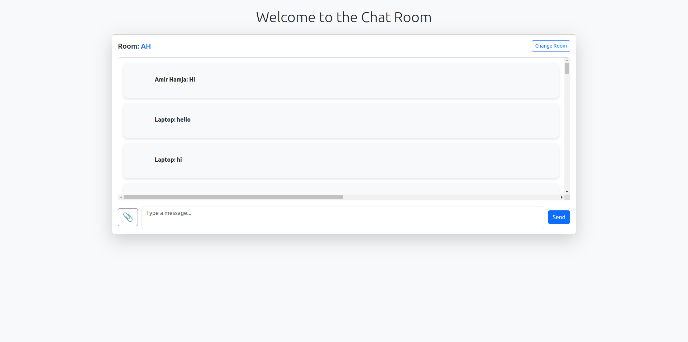
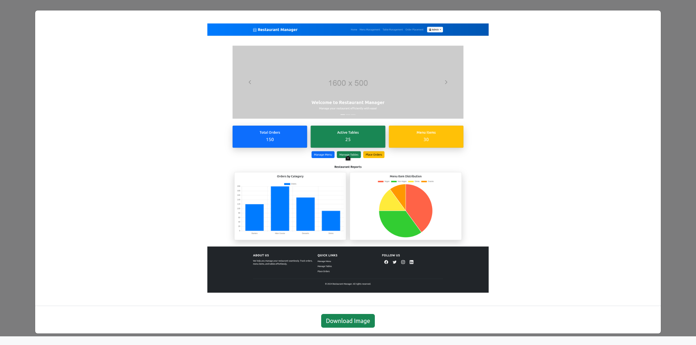

Here’s a sample README.md for your chat room project:

```markdown
# Chat Room with Image Attachment

This is a simple real-time chat application where users can send text messages and images. The app uses WebSockets for real-time communication and includes an image zoom modal for viewing images in full size.

## Features

- **Real-time messaging** using WebSockets
- **Image attachments** with preview and zoom functionality
- **Emoji picker** for adding emojis to messages
- **Responsive design** using Bootstrap for mobile-first UI
- **Image download** option for sent images
- **Chat room management** with the ability to change rooms

## Tech Stack

- **Frontend**: HTML, CSS, JavaScript, Bootstrap
- **WebSocket**: WebSocket for real-time messaging
- **Emoji Picker**: [@joeattardi/emoji-button](https://github.com/joeattardi/emoji-button)

## Installation

To get the project running locally:

1. Clone this repository:
   ```bash
   git clone https://github.com/your-username/chat-room.git
   ```
   
2. Open the `index.html` file in your browser:
   ```bash
   open index.html
   ```
   Alternatively, you can serve it through a local server for better performance with WebSockets.

## How It Works

1. **Room Creation**: The app prompts users to enter a room name and device name when first loaded. You can change the room anytime by clicking on the "Change Room" button.
2. **Messaging**: Type a message in the textarea and click "Send" or press Enter to send the message. Images can also be sent by selecting an image from the file input.
3. **Image Viewing**: When an image is received, it is displayed in the chat log as a thumbnail. Clicking on the image will open a modal where you can zoom in and download the image.
4. **Emoji Support**: You can add emojis to your messages using the emoji picker button.
5. **Responsive**: The app is designed to be mobile-friendly, making it suitable for use on phones and tablets.

## Usage

- **Send a message**: Type your message and click "Send" or press Enter.
- **Send an image**: Click the attachment icon and choose an image from your device.
- **Zoom image**: Click on any image in the chat to open it in a zoom modal.
- **Change room**: Click the "Change Room" button to create a new chat room.

## Screenshots

### Chat Room Interface



### Image Zoom Modal



## Future Improvements

- User authentication (login/signup).
- User-specific message history (local storage or backend).
- Notification for new messages.
- More customization options for message styles.

## License

This project is licensed under the MIT License - see the [LICENSE](LICENSE) file for details.

## Acknowledgments

- [Bootstrap](https://getbootstrap.com/)
- [Emoji Button](https://github.com/joeattardi/emoji-button)
```

### Notes:
- Replace the placeholders like `images/chat-room-interface.png` with actual image paths if you want to showcase screenshots in the README.
- Update the repository link (`https://github.com/your-username/chat-room.git`) to your actual GitHub repo URL.
  
Feel free to modify it further based on your project details!